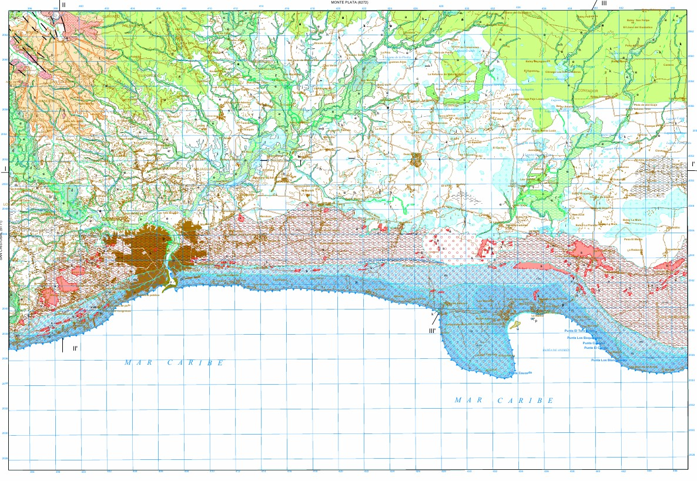

```{r setup, include=FALSE}
knitr::opts_chunk$set(echo = TRUE, warning = FALSE, message = FALSE, out.width = '100%', fig.retina = 4)
```

```{r, include=F}
output_format <- knitr::opts_knit$get("rmarkdown.pandoc.to")
repo_url <- system("git config --get remote.origin.url", intern = TRUE)
repo_name <- sub(".git$", "", basename(repo_url))
org_name <- basename(dirname(repo_url))
rmd_filename <- tools::file_path_sans_ext(basename(knitr::current_input()))
github_pages_url <- paste0("https://", org_name, ".github.io/", repo_name, "/", rmd_filename, ".html")
```

```{r, results='asis', echo=F}
if (grepl('gfm', output_format)) {
  cat('Versión HTML (quizá más legible), [aquí](', github_pages_url, ')\n', sep = '')
} else if (output_format == 'latex') {
  cat('Versión HTML (quizá más legible), [aquí](', github_pages_url, ')\n', sep = '')
}
```

# Fecha/hora de entrega

**26 de agosto de 2024, 7:59 pm.**

# Ejercicio 1. Mapa geomorfológico de RD

## Pasos

1. Abre una hoja del [mapa geomorfológico escala 1:100,000 de RD](https://sgn.gob.do/index.php/geologia-y-tematicos/info-geomorfologia). Asegúrate de que, el que elijas, dispone de memoria geomorfológica, que no es la hoja "Santo Domingo (6271)", y que, además, cuenta con al menos diez elementos de leyenda.

2. Concéntrate en la leyenda. Elige tres elementos de la leyenda. **IMPORTANTE**. Dado que la layenda es estándar para todo el país, algunos elementos que están en la leyenda podrían no estar representados en la hoja que elijas. Asegúrate de que los elementos de leyenda que elijas, estén representados en el mapa seleccionado.

3. Documéntate sobre ellos brevemente. Usa libros, inteligencia artificial, imágenes, artículos científicos.

4. Identifica la localización de cada uno de los tres elementos en el mapa. Anótalos.

5. (**ENTREGABLE**) Redacta, en dos párrafos, una descripción de estos tres elementos, primero indicando cuáles elegiste, y luego redactando tu descripción. No te preocupes si omites detalles técnicos o si no conoces los pormenores de cada elemento. Investiga rápidamente sobre qué son dichos elementos, sin profundizar excesivamente. Más bien, céntrate en describir lo que ves en el mapa, los patrones espaciales que ves en relación con dichos elementos (lo necesitarás luego).

6. (**ENTREGABLE**) Formula al menos tres preguntas de investigación en relación con uno o varios de los elementos elegidos (te dejo ejemplos abajo). La primera pregunta deberá tratar sobre la distribución espacial (e.g. el patrón singular o no) de uno o varios elementos (puedes usarlos a todos, o sólo uno). La segunda pregunta debe ser de tipo metodológico sobre el o los elementos (de nuevo, puedes mezclar todos los elementos, o elegir uno para formular la pregunta), donde te plantees cuestiones (dudas) sobre cómo estudiarlos. La tercera pregunta de tipo geomorfométrico, donde te plantees cuestiones sobre el tamaño o forma de uno o de todos los elementos seleccionados.

## Solución aportada por el tali

Hoja elegida: Santo Domingo (HGM6271)

Elementos de leyenda elegidos: (1) Gravas, arenas y lutitas (Llanura de inundación). Pleistoceno-Holoceno; (2) Piedomente; (3) Dolina.

> **MANDATO DEL TALI**. 5. Redacta, en dos párrafos, una descripción de estos tres elementos, primero indicando cuáles elegiste, y luego redactando tu descripción. No te preocupes si omites detalles técnicos o si no conoces en detalle los elementos elegidos. Investiga rápidamente sobre qué son, pero no pierdas tiempo en obtener detalles. Más bien, céntrate en describir lo que ves en el mapa, los patrones espaciales que ves en relación con dichos elementos.

Para desarrollar esta práctica, **elegí la hoja "Santo Domingo (6271)", del Mapa geomorfológico y de procesos activos susceptibles de constituir riesgo geológico de la República Dominicana, escala 1:100,000** (Díaz de Neira, 2010). La hoja muestra la geomorfología del área correspondiente a la provincia Santo Domingo y entorno (ver figura 1). La leyenda se divide en dos grandes grupos, "Formas" y "Formaciones superficiales", que corresponden respectivamente a los elementos morfológicos (símbolos puntuales mostrados de forma unitaria o conformando tramas, así como símbolos lineales) y a los depósitos predominantes (rellenos simbolizados empleando variables visuales de tono e intensidad). Ambos elementos de leyenda pueden combinarse para dar una idea completa de la geomorfología de un área determinada, por lo que no son mututamente excluyentes.

Elegí tres elementos del mapa para aprender más sobre ellos, conocer mejor su forma de representación en el mapa, y describir sus patrones espaciales. Los elementos elegidos fueron: (1) Gravas, arenas y lutitas (Llanura de inundación). Pleistoceno-Holoceno, (2) Piedomente y (3) Dolina. A continuación, elaboro más detalles sobre cada uno de estos. Las **gravas, arenas y lutitas en llanura de inundación**, atribuidas al Pleistoceno-Holoceno, son formaciones superficiales representadas en el mapa por medio de polígonos alargados con relleno de color verde, a los cuales se les ha añadido el rótulo "h" para asistir al lector o lectora en la identificación inequívoca. Esta **formación superficial**, típica de sistemas fluviales de régimen permanente o semipermanente (Gutiérrez Elorza, 2008), conforma el **relleno de fondos de valle de múltiples arroyos y cañadas** que circulan tanto sobre la superficie del karst de plataforma del sudeste de República Dominicana, como en las áreas de piedemonte del enlace con los sistemas montañosos de la sierra de Yamasá y Los Haitises-cordillera Oriental. Por otro lado, los **piedemontes son formas** representadas en el mapa mediante líneas de trazo continuo color mamey. Comúnmente, se distribuyen rodeando al menos dos "monte-isla" (De Pedraza Gilzans, 1996) situados al norte de la ciudad de Santo Domingo, en el enlace con la sierra de Yamasá, que son los denominados "cerro Gordo" y "loma Sierra Prieta". Estas morfologías están **recubiertas por formaciones superficiales de carácter poligénico** (múltiples procesos que dan lugar a su formación), conformadas principalmente por gravas, arenas y lutitas de tonos rojizos, atribuidas al Pleistoceno. Finalmente, las **dolinas son depresiones cerradas del karst, con planta circular o elíptica \[sic\] y de tamaño relativamente pequeño, con diámetros que van comúnmente desde los pocos metros hasta, excepcionalmente, el kilómetro** (Gutiérrez Elorza, 2008). Estas depresiones se desarrollan sobre roca caliza (ocurren también en otras rocas, como los yesos, pero en el área de interés, sólo se observan en calizas), y en su génesis intervienen procesos geoquímicos de disolución y mecánicos. En la hoja de Santo Domingo, **las dolinas están rellenas fundamentalmente por arcillas de descalcificación**, atribuidas al Pleistoceno-Holoceno, y se encuentran **repartidas fundamentalmente en el karst de plataforma litoral** de la llanura sudoriental de República Dominicana.


**Figura 1**. Captura de la hoja "Santo Domingo (6271)", Mapa geomorfológico de la República Dominicana (Díaz de Neira, 2010)

> **MANDATO DEL TALI**. 6. Formula al menos tres preguntas de investigación en relación con uno o varios de los elementos elegidos (te dejo ejemplos abajo). La primera pregunta deberá tratar sobre la distribución espacial (e.g. el patrón singular o no) de uno o varios elementos (puedes usarlos a todos, o sólo uno). La segunda pregunta debe ser de tipo metodológico sobre el o los elementos (de nuevo, puedes mezclar todos los elementos, o elegir uno para formular la pregunta), donde te plantees cuestiones (dudas) sobre cómo estudiarlos. La tercera pregunta de tipo geomorfométrico, donde te plantees cuestiones sobre el tamaño o forma de uno o de todos los elementos seleccionados.

- ¿Por qué en la hoja analizada la forma piedemonte sólo aparece asociada con los monte-isla? Pregunta complementaria: ¿Es posible delimitar el piedemonte basándonos sólo en la pendiente?

- Sobre La formación superficial "gravas, arenas y lutitas en llanura de inundación", cuya representación en planta es normalmente alargada y de corta anchura, ¿es posible su delimitación con técnicas avanzadas de _machine learning_ o de _deep learning_?

- ¿Tienen las dolinas de la hoja Santo Domingo un tamaño promedio de 1 ha? Pregunta complementaria: ¿Son mayoritariamente circulares o elipsoidales?

# Ejercicio 2. Comparación de Elevaciones entre el Mapa Topográfico Nacional y SRTM"

## Objetivo

El objetivo de esta asignación es aplicar la prueba t de Student para muestras pareadas, comparando las elevaciones obtenidas de un Mapa Topográfico Nacional (MTN) con las elevaciones obtenidas del modelo de elevación digital SRTM. Los estudiantes recolectarán sus propios datos y realizarán los cálculos manualmente.

## Recolección de Datos

### Paso 1: Selección del Mapa Topográfico Nacional

1. Selecciona cualquier hoja del Mapa Topográfico Nacional (MTN) disponible en tu área de estudio.
2. Identifica siete puntos de interés en la hoja del MTN. Para cada punto, registra las coordenadas X e Y en formato UTM (normalmente serán NAD27 o EPSG:26719); elige mejor intersecciones de cuadrículas. En cada coordenada, determina la elevación Z (en metros) usando las curvas de nivel.

Completa una tabla como la siguiente con los datos obtenidos:

| X            | Y           | Z (MTN) (m) | Z (SRTM) (m) |
|--------------|-------------|-------------|--------------|
| &nbsp;       | &nbsp;      | &nbsp;      | &nbsp;       |
| &nbsp;       | &nbsp;      | &nbsp;      | &nbsp;       |
| &nbsp;       | &nbsp;      | &nbsp;      | &nbsp;       |
| &nbsp;       | &nbsp;      | &nbsp;      | &nbsp;       |
| &nbsp;       | &nbsp;      | &nbsp;      | &nbsp;       |
| &nbsp;       | &nbsp;      | &nbsp;      | &nbsp;       |
| &nbsp;       | &nbsp;      | &nbsp;      | &nbsp;       |

### Paso 2: Obtención de Elevaciones desde el SRTM

1. Utiliza una app para obtener la elevación correspondiente a cada una de las coordenadas (X, Y) registradas en el MTN. Si no tienes una, entonces usa el script que se encuentra en el director "compartidos" del servidor RStudio (puedes acceder desde tu teléfono.
2. Introduce las coordenadas X e Y en la app o en el script, y registra la elevación resultante en la columna Z (SRTM) de la tabla.

### Paso 3: Preparación de los Datos

Ahora tendrás una tabla completa con 7 pares de datos de elevaciones para cada punto (Z (MTN) y Z (SRTM)).

## Aplicación de la Prueba t de Student para Muestras Pareadas

### Fórmula de la Prueba t para Muestras Pareadas

Recuerda que la prueba t de Student para muestras pareadas se usa para comparar las medias de dos conjuntos de datos emparejados. La fórmula de la estadística t es:

$$
t = \frac{\bar{D}}{s_D / \sqrt{n}}
$$

Donde:

- $\bar{D}$ es la media de las diferencias entre las elevaciones emparejadas (Z (MTN) - Z (SRTM)).
- $s_D$ es la desviación estándar de las diferencias.
- $n$ es el número de pares de datos (en este caso, 7).

Los grados de libertad (df) se calculan como:

$$
df = n - 1
$$


### Ejemplo Práctico

Supongamos que tienes los siguientes datos (debes hacerlo con tus datos):

| X            | Y           | Z (MTN) (m) | Z (SRTM) (m) |
|--------------|-------------|-------------|--------------|
| 123456       | 789012      | 500         | 495          |
| 123457       | 789013      | 480         | 475          |
| 123458       | 789014      | 460         | 462          |
| 123459       | 789015      | 445         | 443          |
| 123460       | 789016      | 430         | 428          |
| 123461       | 789017      | 420         | 419          |
| 123462       | 789018      | 410         | 408          |

1. **Calcular las diferencias $D_i$ entre Z (MTN) y Z (SRTM) para cada punto**:

$$
D = Z_{MTN} - Z_{SRTM}
$$

| Z (MTN) | Z (SRTM) | D (MTN - SRTM) |
|---------|----------|----------------|
| 500     | 495      | 5              |
| 480     | 475      | 5              |
| 460     | 462      | -2             |
| 445     | 443      | 2              |
| 430     | 428      | 2              |
| 420     | 419      | 1              |
| 410     | 408      | 2              |


2. **Calcular la media de las diferencias $\bar{D}$**:

$$
\bar{D} = \frac{\sum D_i}{n} = \frac{5 + 5 - 2 + 2 + 2 + 1 + 2}{7} = \frac{15}{7} \approx 2.14
$$

3. **Calcular la desviación estándar de las diferencias $s_D$** usando la fórmula:

$$
s_D = \sqrt{\frac{\sum (D_i - \bar{D})^2}{n - 1}}
$$

Primero, calcula la suma de los cuadrados de las diferencias respecto a la media de las diferencias:

$$
s_D^2 = \frac{\sum (D_i - \bar{D})^2}{n - 1}
$$

Donde:

$$
\sum (D_i - \bar{D})^2 = (5 - 2.14)^2 + (5 - 2.14)^2 + (-2 - 2.14)^2 + (2 - 2.14)^2 + (2 - 2.14)^2 + (1 - 2.14)^2 + (2 - 2.14)^2
$$

Calcula cada término:

$$
(5 - 2.14)^2 \approx 8.16, \quad (5 - 2.14)^2 \approx 8.16, \quad (-2 - 2.14)^2 \approx 17.88
$$

$$
(2 - 2.14)^2 \approx 0.02, \quad (2 - 2.14)^2 \approx 0.02, \quad (1 - 2.14)^2 \approx 1.31, \quad (2 - 2.14)^2 \approx 0.02
$$

Suma:

$$
\sum (D_i - \bar{D})^2 \approx 35.57
$$

Luego, la varianza de las diferencias:

$$
s_D^2 = \frac{35.57}{7 - 1} \approx 5.93
$$

Y la desviación estándar:

$$
s_D = \sqrt{5.93} \approx 2.43
$$

4. **Calcular la estadística t**:

$$
t = \frac{\bar{D}}{s_D / \sqrt{n}} = \frac{2.14}{2.43 / \sqrt{7}} = \frac{2.14}{0.92} \approx 2.35
$$

5. **Grados de libertad**:

$$
df = 7 - 1 = 6
$$

6. **Determinación del valor crítico:**

Para un nivel de significancia $\alpha$ de 0.05 y 6 grados de libertad, el valor crítico de $t$ en una prueba de dos colas es aproximadamente ±2.447 (el valor mínimo lo puedes obtener en R con el código `qt(p = 0.025, df = 6)`, o usando `qt(p = 0.975, df = 6, lower.tail = F)`, y el valor máximo con `qt(p = 0.975, df = 6)`, pero también lo puedes buscar en tablas estadísticas). Esto significa que si el valor del estadístico de prueba obtenido es mayor que +2.447, o menor que -2.447, podemos rechazar la hipótesis nula de igualdad de medias. En caso contrario, no podemos rechazar la hipótesis nula de igual de medias. Si lo hiciéramos a través del valor $P$, rechazaríamos la hipótesis nula si el valor $P$ fuese menor que $\alpha$ (que en nuestro caso, elegimos 0.05), y no rechazaríamos la hipótesis nula si el valor $P$ fuese mayor que $\alpha$.

7. **Conclusión:**

Dado que el valor calculado de $t$ (+2.352) es menor que el valor crítico de $t$ por la derecha (+2.447) y mayor que el valor crítico por la izquierda, no podemos rechazar la hipótesis nula. Esto significa que no hay diferencias significativas entre las medias de las elevaciones obtenidas por medio del mapa topográfico nacional (`Z (MTN)`) y por medio del modelo digital de elevaciones SRTM (`Z (SRTM)`) en este ejemplo.

### Recapitulando

Usando tus propios datos de elevaciones (Z (MTN) y Z (SRTM)):

1. Calcula las diferencias $D_i$ entre Z (MTN) y Z (SRTM).
2. Calcula la media de las diferencias $\bar{D}$.
3. Calcula la desviación estándar de las diferencias $s_D$.
4. Calcula la estadística *t*.
5. Determina los grados de libertad.
6. Compara el valor de t calculado con el valor crítico y concluye si hay una diferencia significativa entre las elevaciones proporcionadas por el MTN y el SRTM.

### ¿Cómo se haría en R?

Presiona el botón `SHOW` si el código no está visible.

```{r, eval = F, echo = T}
# Ejemplo en R
# Los datos deben colocarse dentro de c() separados por coma
# por ejemplo c(100, 205, 112, ..., 230)
Z_MTN <- c()
Z_SRTM <- c()
t.test(Z_MTN, Z_SRTM, paired = TRUE)
```

**Nota**: los cálculos se pueden realizar a mano o con una calculadora del teléfono, utilizando las fórmulas proporcionadas.

## Referencias

Triola, M. F. (2012). Estadistica. España: Pearson Education.